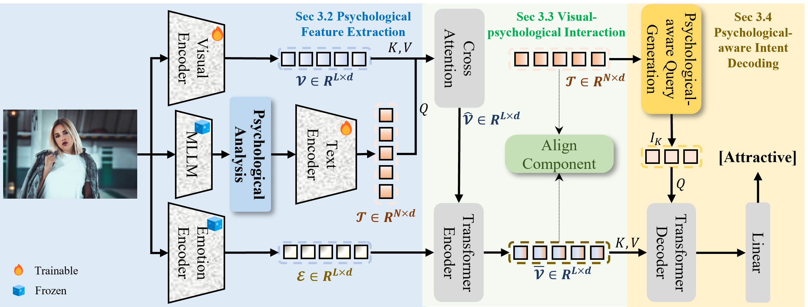

# PsyIntent: Psychological-Inspired Visual Intent Recognition via Multi-modal Large Language Models

Official implementation of **PsyIntent**, a psychologically inspired Transformer
for visual intent recognition in social-media images. PsyIntent distills a
concise *psychological analysis* from a frozen MLLM (Janus-Pro-7B), encodes it
(BERT text features + EAMB-Net emotion features), fuses it with the visual
features (cross-attention + Transformer encoder + a global semantic alignment
objective), and decodes the intents with a slot-attention-style
**Psychological-aware Query Generation (PQG)** followed by a Transformer decoder.

> Mingyao Zhou, Bin Yang, Bo Du, Mang Ye. *Psychological-Inspired Visual Intent
> Recognition via Multi-modal Large Language Models.* (Under Review.)



*The PsyIntent architecture first extracts the visual (𝒱), psychological
analysis (𝒯), and emotional (ℰ) features from an image. These features are
fused through cross-modal interactions to produce enriched visual
representations, with a global semantic alignment component reinforcing
multimodal associations. Finally, an intent decoding module, featuring a
psychological-aware query generator that creates intent queries from the
psychological analysis features, feeds both the queries and the enriched
representations into a Transformer decoder for intent prediction.*

### Contributions

- We propose a framework that integrates a frozen MLLM to extract psychological
  features and capture the nuances of intent from a psychological perspective,
  improving the performance of intent mining in social-media scenarios. This
  replaces the non-public Instagram hashtag library of prior work with a
  reproducible, MLLM-driven psychological-analysis pipeline.
- A **Visual-Psychological Interaction (VPI)** module fuses multimodal features
  via cross-attention and a global semantic alignment, enhancing intent
  representation, while a **Psychological-aware Intent Decoding (PAID)** module
  generates image-specific queries from the psychological analysis for
  recognizing intent.
- Experiments on three public social-media datasets (Intentonomy, MDID,
  MET-MeMe) confirm the effectiveness of the proposed method and highlight the
  important role of psychological cues in intent recognition.

## Method overview

PsyIntent has three components:

1. **Psychological Feature Extraction (PFE)** — a frozen Janus-Pro-7B generates
   a one-sentence psychological analysis offline (cached and reused); BERT
   encodes the text 𝒯 and a frozen EAMB-Net provides the emotion feature ℰ.
2. **Visual-Psychological Interaction (VPI)** — cross-attention refines the
   visual feature with the psychological text (Eq. 1), a Transformer encoder
   fuses 𝒱̂ with the emotion feature ℰ (Eq. 2), and a **bidirectional** global
   semantic alignment (GSA) loss aligns the image and text embeddings.
3. **Psychological-aware Intent Decoding (PAID)** — PQG runs slot attention over
   the psychological text to produce image-specific intent queries (softmax over
   the 28-slot axis, L1 normalization over the N-token axis). Following Slot
   Attention, the slots compete for each text token. For the slot update, each
   slot first absorbs the aggregated cue through an additive
   residual to form an intermediate state, and then stacks an MLP residual on the
   LayerNorm of that intermediate state. The resulting queries are decoded by a Transformer decoder.

The classification loss is **Asymmetric Loss**. The DUDC
and IRP losses and their fixed weights follow the LabCR baseline. All metrics
use a 0.5 sigmoid decision threshold (the datasets are multi-label).

## Directory structure

```
PsyIntent/
├── README.md
├── LICENSE
├── requirements.txt
├── generate_analysis/
│   └── generate_psychological_analysis.py   # Janus-Pro-7B analysis generation
├── src/                                     # shared model + training code
│   ├── _init_paths.py
│   ├── train.py            # distributed training entry point
│   ├── test.py             # single-GPU evaluation (Intentonomy, MET-MeMe)
│   ├── test_mdid.py        # single-GPU evaluation (MDID, feature-based)
│   ├── models/             # PsyIntent model, transformer, backbones, losses
│   ├── data_utils/         # dataset loaders, metrics
│   └── utils/              # logging, config, metrics helpers
├── intentonomy/            # Intentonomy: scripts + open-sourced analysis JSONs
│   ├── train.sh
│   ├── test.sh
│   └── annotations/{train,val,test}_janus7b_psy.json
├── mdid/                   # MDID (fold 0): scripts + split JSONs
│   ├── train.sh
│   ├── test.sh
│   └── annotations/new_{train,val}_split_0.json
├── metmeme/                # MET-Meme: scripts + open-sourced analysis JSONs
│   ├── train.sh
│   ├── test.sh
│   └── annotations/{train,val,test}_janus7b_psy.json
└── output/<dataset>/test_<timestamp>/      # an evaluation run
    ├── saved_data_tmp.0.txt                # sigmoid scores + targets (mAP / F1 input)
    └── *.log                               # evaluation log
```

Each dataset is self-contained: its `train.sh` / `test.sh` scripts and the
annotation files PsyIntent needs (including the MLLM psychological-analysis
JSONs used by the released checkpoints) live together under the dataset folder.
Images / pre-extracted features are not redistributed — see Data preparation.

The single-GPU evaluation scripts (`test.sh`) write one `saved_data_tmp.0.txt`
(sigmoid scores concatenated with the binary targets), from which mAP and the
F1 variants are computed; the metrics are printed to the log and stdout.

## Installation

```bash
pip install -r requirements.txt
```

PyTorch >= 2.1 is required (the code uses `torch.amp` and `weights_only` APIs).
BERT (`bert-base-uncased`) and the ResNet-101 ImageNet weights are downloaded
automatically by HuggingFace / torchvision on first use.

### Pre-trained EAMB-Net emotion weights

Download the pre-trained EAMB-Net checkpoint from the official repository
<https://github.com/Hangwei-Chen/EAMB-Net> and place it at
`PsyIntent/pretrained/emotion_model.pth` (a `state_dict` saved under the
`'model'` key). The emotion encoder loads this path automatically; override it
with the `PSYINTENT_EMOTION_WEIGHTS` environment variable if needed.

### Trained Intentonomy checkpoint

The trained Intentonomy checkpoint is provided as a release asset (≈943 MB):

<https://github.com/mingyao1120/PsyIntent/releases/download/intentonomy-best/intentonomy_best.pth.tar>

Download it and place it at `intentonomy/intentonomy_best.pth.tar`, then evaluate with:

```bash
bash intentonomy/test.sh intentonomy/intentonomy_best.pth.tar
```

## Data preparation

The annotation files PsyIntent needs — including the **MLLM psychological-analysis
JSONs** — ship inside each dataset folder under
`annotations/` (Intentonomy: 12,740/498/1,217; MDID fold 0: 1,040/259; MET-Meme:
2,395/798/800). Images and pre-extracted features are **not** redistributed; point
PsyIntent at them with the `PSYINTENT_DATA_ROOT` environment variable (default
`PsyIntent/_data`). Expected layout:

```
$PSYINTENT_DATA_ROOT/images/
├── intentonomy/
│   ├── low/{image_id}.jpg
│   └── {train,val,test}_label_vectors_intentonomy2020.npy
├── mdid_features/{image_id}.npy          # pre-extracted ResNet-18 features
└── metmeme/{image_id}                    # English images
```

### Intentonomy
Download the Intentonomy dataset from the [official release](https://github.com/KMnP/intentonomy)
and place the images under `$PSYINTENT_DATA_ROOT/images/intentonomy/low/`. The
`*_label_vectors_intentonomy2020.npy` label vectors live under
`images/intentonomy/`. The `*_janus7b_psy.json` annotation files (with the
psychological analysis in `caption_by_Janus_7B`) ship in
`intentonomy/annotations/` — or regenerate them with the script below.

### Generating the psychological analysis (Janus-Pro-7B)

Install the [Janus](https://github.com/deepseek-ai/Janus) package and download
the `Janus-Pro-7B` weights, then:

```bash
cd PsyIntent/generate_analysis
python generate_psychological_analysis.py \
    --prompt_type psy --splits train val test \
    --model_path /path/to/Janus-Pro-7B \
    --image_root /path/to/intentonomy/low \
    --anno_dir  ../intentonomy/annotations \
    --output_dir ../intentonomy/annotations
```

Janus-Pro-7B uses nucleus sampling (temperature = 1.0, top-p = 0.95,
max new tokens = 256). The analysis is generated offline once per image and
cached. The same script also supports the confound-control conditions
(`--prompt_type generic|objscene|shuffled|random`).

### MDID
The MDID (Multimodal Document Intent Dataset) release lives at
[documentIntent_emnlp19](https://github.com/karansikka1/documentIntent_emnlp19)
(EMNLP 2019). MDID images are **not publicly available**, so PsyIntent runs on
the user-provided image caption ("Raw") together with pre-extracted ResNet-18
visual features (`.npy`), without an image backbone or emotion encoder. MDID has
no held-out test set; this release uses fold 0 (the "Val_0 set" comparable to
prior work). The fold-0 split JSONs ship in `mdid/annotations/`.

### MET-Meme
Download the English split of
[MET-Meme](https://github.com/liaolianfoka/MET-Meme-A-Multi-modal-Meme-Dataset-Rich-in-Metaphors)
(SIGIR 2022). The `*_janus7b_psy.json` annotation files (with the psychological
analysis in `caption_by_Janus_7B`) ship in `metmeme/annotations/`.

## Usage

Each dataset folder contains its own `train.sh` / `test.sh`. Training uses 2 GPUs
by default (adjust `CUDA_VISIBLE_DEVICES` / `--nproc_per_node` as needed):

```bash
bash intentonomy/train.sh   # Intentonomy
bash metmeme/train.sh       # MET-Meme
bash mdid/train.sh          # MDID (feature-based)
```

Evaluation (single GPU):

```bash
bash intentonomy/test.sh [checkpoint]
bash metmeme/test.sh       [checkpoint]
bash mdid/test.sh          [checkpoint]
```

If no checkpoint path is supplied, the scripts default to the
`model_best.pth.tar` produced by the corresponding training run.

## Configuration

The defaults in `src/train.py` reproduce the paper. The key ones:

| Component | Value |
|---|---|
| Visual encoder | ResNet-101 (ImageNet), input 224×224 |
| Text encoder | BERT (`bert-base-uncased`), max 64 tokens |
| Emotion encoder | EAMB-Net (frozen) |
| Analysis MLLM | Janus-Pro-7B (frozen), nucleus sampling (T=1.0, top-p=0.95, 256 tokens) |
| Hidden dim / encoder / decoder layers | 2048 / 1 / 2 |
| PQG slot iterations K | 3 |
| Asymmetric Loss | γ+ = 0, γ− = 2, δ = 0 |
| GSA coefficient λ_al (`--gac`) | 5 (10 for MDID) |
| GSA temperature τ_gsa (`--temperature`) | 0.07 |
| DUDC balance α (`--alpha`) | 0.4 |
| Decision threshold | 0.5 (sigmoid, multi-label) |

## Acknowledgments

This project builds on Query2Label, LabCR, Asymmetric Loss, Slot Attention,
Janus-Pro, and the Intentonomy dataset. See `LICENSE` for details.

